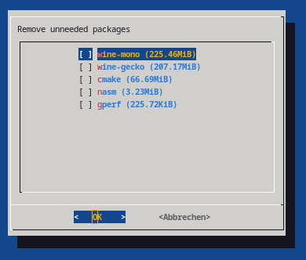

# PacUnclutter
An interactive console helper to remove unneeded packages in ArchLinux.



## Usage

```
$ ./pacUnclutter.sh --help
./pacUnclutter.sh [options] -- [additional arguments for pacman]
Options:
	-d <packagename> | --deselect <packagename>
		Deselect a package (when using --select-all)
	-s <packagename> | --select <packagename>
		Pre select packages
	-a | --select-all
		Select all (uneeded) packages
	-o <order-by>| --order <order-by>
		Order by either "name" or "size"
	-u | --uninstall
		Uninstall packages without showing a dialog

Example - ask which packages to remove ordered by size:
	./pacUnclutter.sh -o size
Example - ask which packages to remove and pre-select all:
	./pacUnclutter.sh -a
Example - ask which packages to remove and pre-select specific ones:
	./pacUnclutter.sh -a -s cmake -s gdb
Example - remove everything unneeded without asking:
	./pacUnclutter.sh -u -a
```

## Installation

```
sudo pacman -S base-devel --needed
makepkg -si
```

## Dependencies

```
sudo pacman -S --asdeps --needed dialog
``` 

- [dialog](https://archlinux.org/packages/core/x86_64/dialog/)
- ([pacman](https://archlinux.org/packages/core/x86_64/pacman/))
- ([shellspec](https://aur.archlinux.org/packages/shellspec))

## UnitTests

To run the unittests [shellspec](https://aur.archlinux.org/packages/shellspec) must be installed.

```
shellspec -f d
```
